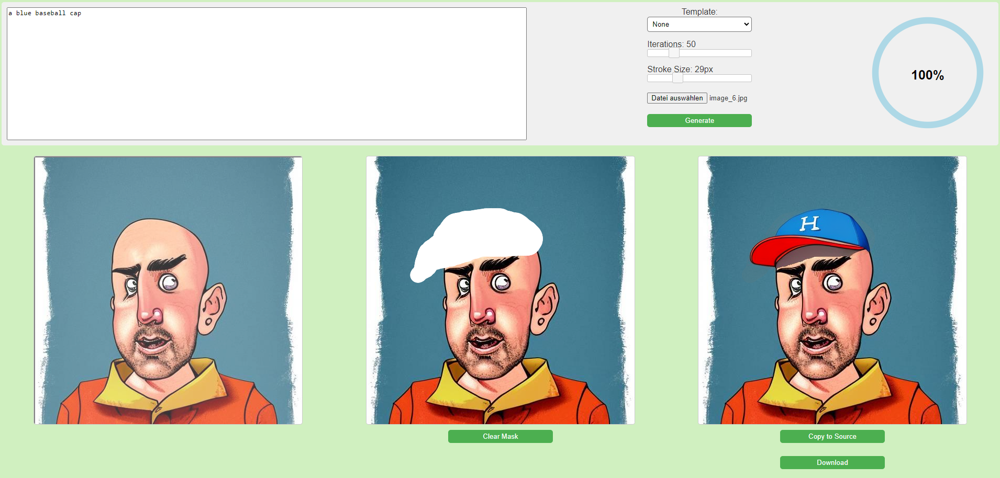

# Dreamshaper v8 Inpainter

This project aims to provide a simple yet useful tool for using the Dreamshaper v8 Inpainting model on any image data on your local computer. Many services allow similar functionality, but restrict the use to specific community guidelines. If you're interested in using inpainting on your own image collection without constraints, this tool might be able to help you.

## Why this tool

There are other tools that provide similar functionality, but with dependency heavy installation procedures. This Inpainter tool tries to make that as easy as possible: Only requires Python dependencies, a simple yet useful web UI, no fancy installation procedure.

## Usage

The inpainting model is downloaded on the first start. Just run the Python script like this:

    ./ds8inpainter.py

Then open a browser at http://127.0.0.1:9919

The usage might still be a little bumpy and I need to sort out a few kinks, but in general what you do is:

1. Click the "Load Image" button, select an image you want to alter, open it.
2. Move the selection rectangle on the left image area until you see the desired cutout in the middle canvas.
3. Draw your desired mask onto the canvas. Dreamshaper v8 can only deal with 512x512px sized areas here, so that's what you can alter at any one time.
4. Enter your text prompt (or leave empty).
5. Select a template (if you want, or leave it at "None" to not dictate a style).
6. Click "Generate" and wait for the progress bar to fill up.
7. Observe the result. If you like it, you can click "Download" to save it.
8. You can click "Copy to Source" to make this image the new start image and can start with a fresh prompt and mask (this clears the mask, but not the prompt text).
9. Repeat at will.

### Drawing

In order to draw a mask, just click and drag. You can either use the mouse wheel or the slider on top to increase/decrease the brush size. If you hold shift, you can erase the drawn mask parts. If you want to start over, click "Clear Mask".

## Requirements

Dreamshaper v8 requires some 2-3GB VRAM and a CUDA capable GPU. If you have a fairly modern GPU, you should be fine. Your generating time may vary based on the hardware you use.

## Opens and Todos

* Allocated image objects in the frontend JS need to be freed properly (right now it's a bit messy).
* When loading a new image after working with a previous one, image artifacts of the previous image might stick around. This needs to get cleaned up properly upon image load.